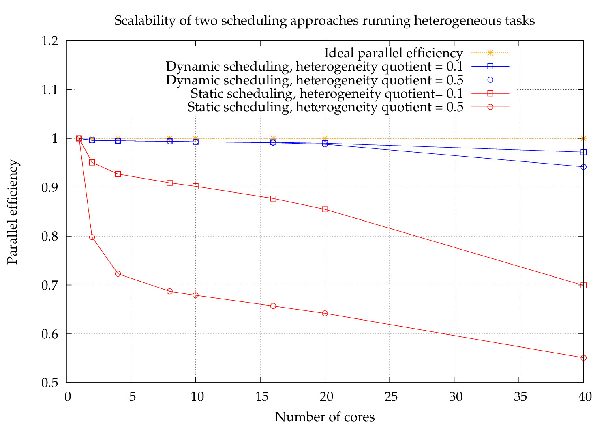

Latest architecture have up to hundreds of cores on the node. Efficiently using that
amount of parallelism, requires a paradigm shift: we must develop new effective
and efficient parallel programming techniques to allow the usage of all parts in
the system efficiently. A popular way to speed up application execution in multi-core machines is task parallelism, 
Key requirements are to have strong scalability, efficiency and dynamic resource management.

Scientific computing applications often involve an iterative step which is run
until the desired convergence. A trivial parallelization of these iterative methods
would be to apply a global barrier at the end of the iterative loop. This ensures
that all the parallel resources synchronize at this point, so that the intended
computations can be done in the next iterations accurately. Numerical solution
of the partial differential equations generate stencils which captures the depen-
dency of the underlying computation. These stencils often have dependency on
neighboring grids only. Therefore, the global barrier is not required to synchro-
nise the computations, and synchronizations with the neighboring sub-domain
often suffices. This can be achieved by introducing local barriers across the
neighboring sub-domains. The task working on a sub-domain can proceed with
its computation in an iteration as soon as all the neighbors have reached this
iteration. The local synchronization does not require all the tasks to be working
in the same iterations. Instead as per their workload and local dependencies,
the tasks on different sub-domains can operate on different iterations at a given
point in time. This allows to avoid potential aggregations generated by the load
imbalance. In this work, we compare the two strategies to schedule tasks in the
shared memory parallel environment:

• Static scheduling using global synchronization at the end of the iterative loop.

• Dynamic scheduling using local synchronization with nearest neighbors.

We have demonstrated that even for perfect load balance, the global synchronization hampers the scalability of the
application and parallel efficiency dramatically reduces to 60% for 40 cores. For
higher load imbalance in the tasks, the global synchronization hurts more. On
the other hand, dynamic scheduling having the local synchronization with near-
est neighbors, achieves an excellent parallel efficiency of 94% for 40 cores, even in
the case of extreme imbalance across the tasks.

